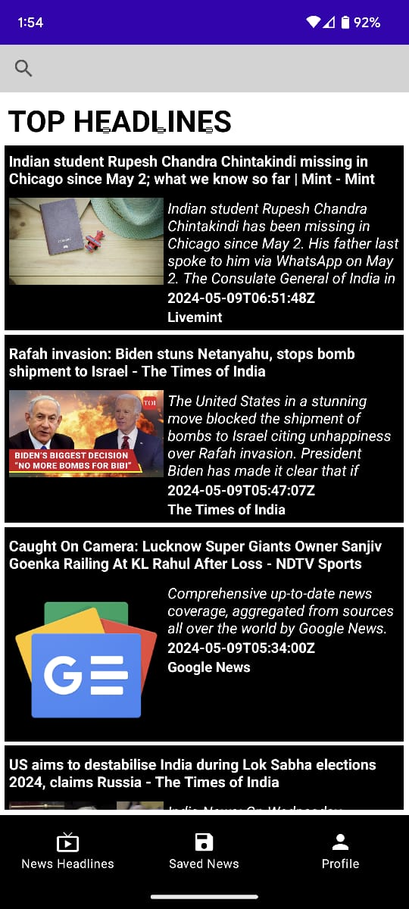

# News API Android Client Application
## Description
A simple android project using [The News API](https://newsapi.org/).

## Screenshots

## How to build on your environment
Replace API key in gradle.properties file.

## Technologies
- [News Api](https://newsapi.org/)
- [Kotlin](https://kotlinlang.org)
- [ViewModel](https://developer.android.com/topic/libraries/architecture/viewmodel)
- [DataBinding](https://developer.android.com/topic/libraries/data-binding)
- [MVVM](https://learn.microsoft.com/en-us/dotnet/architecture/maui/mvvm)
- [Coroutines](https://github.com/Kotlin/kotlinx.coroutines)
- [Hilt](https://developer.android.com/training/dependency-injection/hilt-android)
- [Room](https://developer.android.com/jetpack/androidx/releases/room)
- [Retrofit](https://square.github.io/retrofit/)
